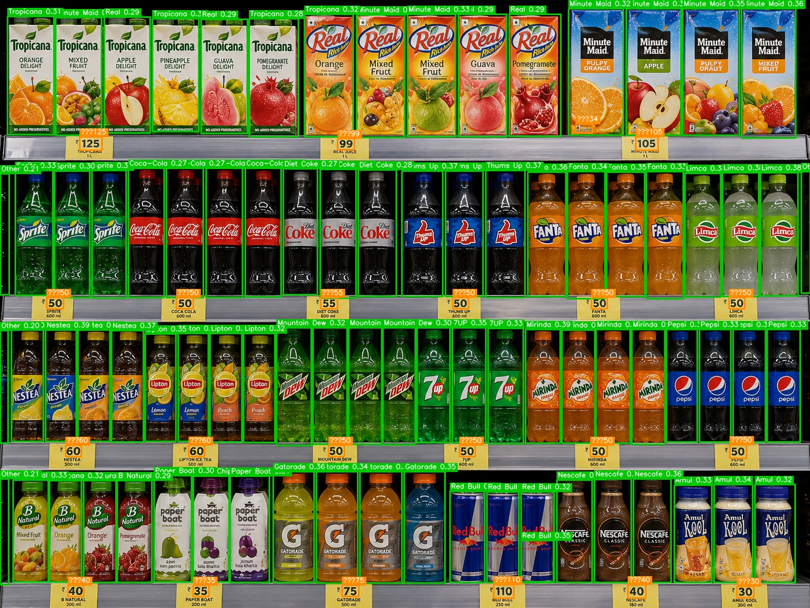
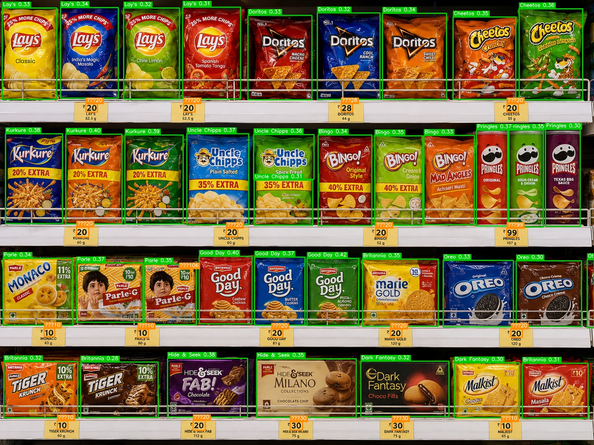
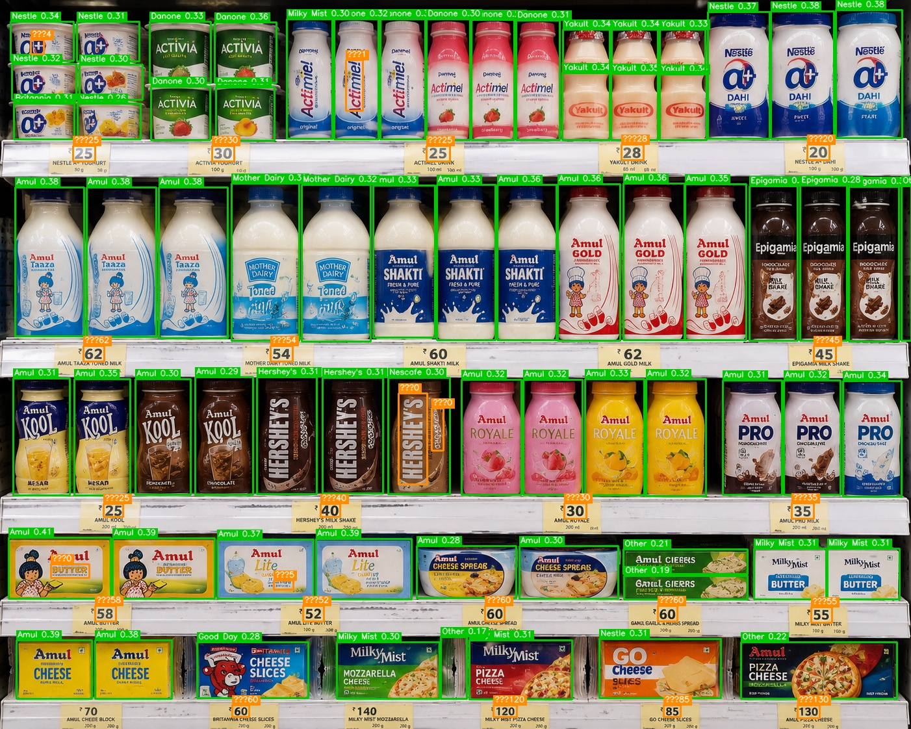
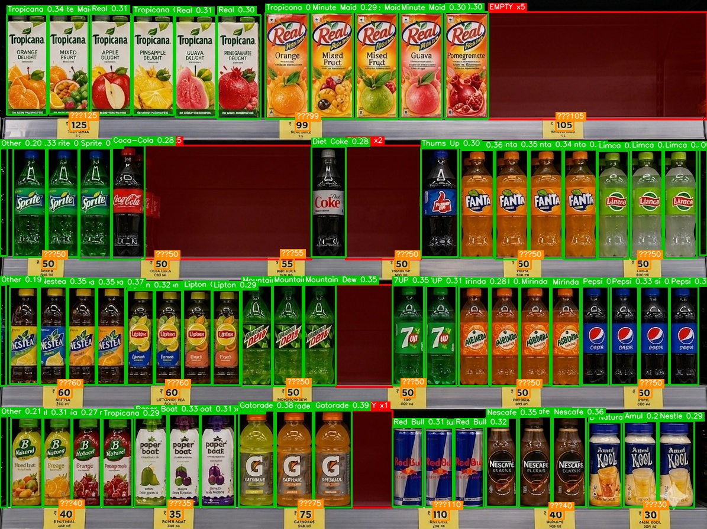

# Retail Shelf Intelligence Pipeline

A prototype ML pipeline that analyzes retail shelf images and produces **brand-wise
shelf presence + product availability** insights. For each shelf image it:

1. **Detects** product facings (YOLOv8 trained on SKU110K)
2. **Classifies** each facing into a brand (CLIP zero-shot; embedding+KNN fallback)
3. **OCRs** shelf labels / price tags (EasyOCR)
4. **Estimates shelf space** — groups facings into rows and computes Share-of-Shelf
5. **Outputs** a business-metrics JSON + an annotated image

Built on top of the original *facings identifier* repo (a YOLOv8/SKU110K detector
plus DINOv2/ResNet18 image embeddings), extended into a clean, modular pipeline.

> This is a prototype, optimised for **practicality on CPU**, not production
> perfection. See [docs/MODEL_SELECTION.md](docs/MODEL_SELECTION.md) for the
> accuracy/speed and CPU-vs-GPU reasoning, and [Limitations](#assumptions--limitations).

## Architecture

```
image ─▶ Detection (YOLOv8/SKU110K) ─▶ crop facings ─▶ Brand classifier
                                                          ├─ CLIP zero-shot (primary)
                                                          └─ DINOv2/ResNet18 + KNN (fallback)
image ─▶ OCR (EasyOCR) ─────────────────────────────────────────────┐
detections ─▶ Shelf-space (rows + Share-of-Shelf) ──────────────────┤
                                                                     ▼
                                                  metrics JSON + annotated image
```

Full diagram and stage table: [docs/ARCHITECTURE.md](docs/ARCHITECTURE.md).

## Setup

Requires Python 3.10+. A CPU-only PyTorch is fine (the project is CPU-friendly).

```bash
# from the repo root
python -m venv venv
venv\Scripts\activate          # Windows  (source venv/bin/activate on Linux/macOS)
pip install -r requirements.txt
```

`models/best.pt` (the SKU110K YOLOv8 detector) ships with the repo. CLIP, DINOv2
and EasyOCR weights download automatically on first run.

## Test images

The three provided shelf images live in `data/test_images/`:

```
data/test_images/
  img_1.jpg   # beverages (juices, sodas, energy drinks)
  img_2.jpg   # snacks / biscuits
  img_3.jpg   # dairy (milk, yoghurt, butter, cheese)
  img_4.png   # beverages with visible out-of-stock gaps (OSA demo)
```

## Usage

```bash
# Analyze all three test images (CLIP classifier, OCR on):
python run.py --input data/test_images --output outputs

# A single image:
python run.py --input data/test_images/img_1.jpg

# KNN fallback over the labelled knowledge base (DINOv2 backbone):
python run.py --input data/test_images/img_1.jpg --classifier knn --backbone dinov2

# Faster run without OCR:
python run.py --input data/test_images --no-ocr

# Experimental: let confident OCR brand text override CLIP (see note below):
python run.py --input data/test_images --ocr-brand-correct
```

For each input image the pipeline writes:

- `outputs/<name>.json` — the metrics dict
- `outputs/<name>_annotated.jpg` — product boxes + brand labels + price-tag overlays

### Output schema

```json
{
  "image_name": "img_1.jpg",
  "total_products": 83,
  "brands": { "Minute Maid": 7, "Tropicana": 5, "Coca-Cola": 4, "Other": 4 },
  "share_of_shelf": { "Minute Maid": "8.5%", "Tropicana": "6.0%" },
  "num_shelf_rows": 4,
  "empty_slots": [
    { "row": 1, "x1": 244, "y1": 246, "x2": 526, "y2": 439,
      "width": 281, "est_missing_facings": 5 }
  ],
  "estimated_missing_facings": 5,
  "ocr_labels": ["₹30", "₹50", "₹99", "₹125"],
  "price_by_brand": { "Coca-Cola": "₹50", "Gatorade": "₹75", "Red Bull": "₹110" }
}
```

`image_name`, `total_products`, `brands`, `ocr_labels` satisfy the assignment's
required schema; `share_of_shelf`, `num_shelf_rows`, `price_by_brand`,
`empty_slots` and `estimated_missing_facings` are added insights.

- `ocr_labels` — price tags read off the shelf edges (`₹` is re-attached;
  EasyOCR drops the glyph).
- `price_by_brand` — each price tied to the brand of the products above its tag.
- `empty_slots` / `estimated_missing_facings` — **On-Shelf Availability (OSA)**:
  per-row gaps between consecutive products that exceed one facing-width are
  flagged as out-of-stock, with a count of how many facings would fit. Drawn on
  the annotated image as red translucent rectangles labelled `EMPTY xN`.

> **Note on `--ocr-brand-correct`:** using OCR'd shelf/pack text to override the
> CLIP brand is *experimental and off by default*. Measured against
> `data/ground_truth.json` it was **net-negative** here: in aisles dominated by one
> brand (e.g. "Amul" repeated across every dairy tag) the brand name bleeds into
> neighbouring products. Kept as an opt-in for clean, non-repeating labels.

## Sample outputs

The pipeline's annotated outputs for the three provided shelf images. Green boxes
are detected product facings + brand labels (with CLIP cosine score); orange
overlays are the OCR'd shelf-edge price tags.

### `img_1.jpg` — beverages (juices, sodas, energy drinks)



- **83 products** detected across **4 shelf rows**
- Brand mix: Minute Maid 7, Tropicana 5, Coca-Cola 4, Fanta 4, Mirinda 4, Mountain Dew 4, Pepsi 4, Gatorade 4, Lipton 4, Nestea 4, B Natural 4, Real 4, Diet Coke 3, Thums Up 3, Sprite 3, Limca 3, 7UP 3, Red Bull 4, Nescafé 3, Amul 3, Paper Boat 2, Other 4 — see [outputs/img_1.json](outputs/img_1.json)
- Prices read: ₹30, ₹34, ₹35, ₹40, ₹50, ₹55, ₹60, ₹75, ₹99, ₹105, ₹110, ₹125

### `img_2.jpg` — snacks / biscuits



- **38 products** detected across **4 shelf rows**
- Brand mix: Lay's 4, Uncle Chipps 3, Britannia 4, Bingo 4, Doritos 3, Good Day 3, Kurkure 3, Pringles 3, Parle 3, Cheetos 2, Oreo 2, Hide & Seek 2, Dark Fantasy 2, Other 3 — see [outputs/img_2.json](outputs/img_2.json)
- Prices read: ₹10, ₹20, ₹28, ₹30, ₹99, ₹106

### `img_3.jpg` — dairy (milk, yoghurt, butter, cheese)



- **72 products** detected across **5 shelf rows**
- Brand mix: Amul 28, Danone 9, Nestlé 8, Yakult 6, Milky Mist 5, Hershey's 3, Epigamia 3, Mother Dairy 2, Britannia 2, Other 4 — see [outputs/img_3.json](outputs/img_3.json)
- Prices read: ₹5, ₹20, ₹25, ₹28, ₹30, ₹35, ₹40, ₹45, ₹52, ₹54, ₹55, ₹58, ₹60, ₹62, ₹85, ₹120, ₹130

### `img_4.png` — beverages with out-of-stock gaps (OSA demo)



- **68 products** detected across **4 shelf rows**
- **5 empty slots, ~15 missing facings** — the big translucent red region in
  row 1 is the depleted Coca-Cola / Diet Coke section; smaller gaps flagged on
  the top Tropicana row and elsewhere. See [outputs/img_4.json](outputs/img_4.json)
  for exact coordinates and per-slot facing counts.
- Demonstrates the pipeline's **On-Shelf Availability** signal.

> Outputs (img_1–img_3) were measured against `data/ground_truth.json` — overall
> per-brand count MAE 0.878. See [docs/MODEL_SELECTION.md](docs/MODEL_SELECTION.md)
> for the accuracy↔speed reasoning and the discussion of known lookalike
> limitations (Tropicana / Real / Minute Maid juice cartons).

## Project layout

```
src/
  shelf_analysis/
    config.py       # paths, device, thresholds, BRAND_PROMPTS taxonomy
    detector.py     # ProductDetector (YOLOv8 wrapper) + Box
    classifier.py   # CLIPClassifier (primary) + KNNClassifier (fallback)
    ocr.py          # ShelfOCR (EasyOCR text detection)
    labels.py       # price extraction, price-by-brand, OCR brand matching
    shelf_space.py  # row clustering + Share-of-Shelf
    visualize.py    # annotated-image rendering
    pipeline.py     # ShelfPipeline orchestration
    io_utils.py     # image / JSON I/O
  img2vec_dino2.py    # DINOv2 embedder  (reused by the KNN fallback)
  img2vec_resnet18.py # ResNet18 embedder (reused by the KNN fallback)
run.py              # CLI entrypoint
scripts/            # evaluate.py, make_diagram.py
docs/               # ARCHITECTURE.md, MODEL_SELECTION.md, architecture.png
data/               # test_images/, knowledge_base/ (KNN gallery), ground_truth.json
models/best.pt      # YOLOv8 SKU110K detector
outputs/            # generated JSON + annotated images
```

## Configuring brands

Brand recognition is driven entirely by `BRAND_PROMPTS` in
[src/shelf_analysis/config.py](src/shelf_analysis/config.py): canonical brand →
list of text prompts. Add or remove a brand by editing this dict — no retraining.
`CLIP_SIM_THRESHOLD` is the open-set cutoff: a crop whose best brand cosine
similarity falls below it is labelled `Other` (this rejects out-of-taxonomy items
instead of forcing them onto the nearest brand). `CLIP_MARGIN` optionally rejects
crops where the top-2 brands are too close.

## Evaluation

Manual facing counts live in [data/ground_truth.json](data/ground_truth.json).
Score the current outputs against them:

```bash
python scripts/evaluate.py --outputs outputs --gt data/ground_truth.json
```

It prints per-image, per-brand absolute count error and an overall MAE, so any
prompt/threshold change is measurable. Flags false positives (`pred>0, true=0`)
and misses (`pred=0, true>0`).

## Assumptions & limitations

- **Detector is class-agnostic** (SKU110K finds product *facings*; the classifier
  names them). Tightly packed or occluded items may merge/split.
- **CLIP zero-shot** captures total counts well but can split near-identical
  packages between lookalike brands (e.g. Tropicana / Real / Minute Maid juice
  cartons). Tune `BRAND_PROMPTS` / `CLIP_SIM_THRESHOLD`, or use the `--classifier
  knn` gallery path for logo-level discrimination. No labelled data required.
- **Share-of-Shelf is a bbox-width proxy** for linear frontage, not pixel-accurate
  segmentation (SAM noted as future work in MODEL_SELECTION.md).
- **OCR**: price tags read reliably (`ocr_labels`, `price_by_brand`). Brand *text*
  on tags/packs is only partly legible, so OCR-based brand **correction** is
  experimental/off by default (it bleeds in brand-repeating aisles — see Usage).
- **Lookalike packages**: near-identical SKUs (e.g. Tropicana / Real / Minute Maid
  juice cartons) get the right *total* but are split imperfectly between the three;
  reliable separation needs the KNN gallery path or a higher-resolution model.
- **CPU-only**: first run downloads model weights; per-image latency is seconds,
  suitable for batch analytics. `DEVICE` auto-detects CUDA for GPU deployment.

## Known flaws & wrong detections

Everything below is **observed**, not hypothetical — collected from the three test
images via `scripts/evaluate.py` and a manual audit of every gallery crop. The
intent is to be honest about where the prototype is weak so the next iteration
knows where to invest. Overall per-brand count **MAE = 0.878** against
[`data/ground_truth.json`](data/ground_truth.json) — good for label-free zero-shot,
not production-grade.

### 1. Juice-carton lookalike confusion (biggest correctness issue)

Tropicana / Real / Minute Maid / B Natural are all rectangular fruit-juice cartons
with orange/fruit artwork. CLIP captures the *total* well but splits between them
imperfectly — cosine scores hover at **0.28–0.32** (CLIP is barely sure):

- `img_1` predicts **Minute Maid 7** vs GT **4** (over-counted by 3)
- `img_1` predicts **Tropicana 5** vs GT **6** (the 1 missing went to Minute Maid)
- In the seeding step, the audit caught **8 misplaced juice-carton crops** —
  e.g. `img_1_b006`, `b009` (Real → labeled Minute Maid),
  `img_1_b042`, `b043` (Tropicana → labeled Real),
  `img_1_b038` (B Natural → labeled Tropicana).

**Why it persists.** ViT-B/32 at low resolution can't reliably read the brand
*text* on the carton, and "fruit juice carton" prompts collapse the three into a
near-tie. Real fix: KNN gallery with a few labeled crops per brand, or a
higher-resolution CLIP model.

### 2. Cross-category leakage to visually-similar packs

Even with the open-set `Other` threshold, a few wrong-aisle items slip through:

- `img_1_b005` — Paper Boat juice bottle → labeled **Uncle Chipps**
- `img_3_b028` — Hershey's milkshake → labeled **Nescafé** (both brown bottles)
- `img_3_b020` — Britannia Cheese Slices → labeled **Good Day** (both red boxes)
- `img_3_b061` — Nestle a+ small cup → labeled **Britannia**
- `img_3_b038` — Danone Actimel → labeled **Milky Mist**
- `img_3_b004`, `b005` — Mother Dairy bottles → labeled **Amul**

These are visual cousins, not random errors — colour/shape similarity beats the
weak brand-text signal.

### 3. Out-of-taxonomy items get a wrong label instead of `Other`

Anything CLIP scores ≥ 0.235 to *some* brand keeps that label, even if the real
brand isn't in our prompt list. Observed:

- **Go Cheese Slices** (`img_3_b031`) → forced into `nestle/`
- **Malkist Masala** (`img_2_b004`) → forced into `britannia/`
- **Malkist Cheese** (`img_2_b010`) → forced into `dark_fantasy/`

Mitigations: raise `CLIP_SIM_THRESHOLD`, or extend `BRAND_PROMPTS` to cover these.

### 4. Detection over-counts (small but real)

YOLOv8/SKU110K occasionally splits one tall facing into two boxes, or detects
shelf-edge gaps:

- `img_1` detected **83 vs GT 78** (+5)
- `img_2` detected **38 vs GT 36** (+2)
- `img_3` Yakult: detected **6 vs GT 3** — the 5-bottle multipack got split.
- `img_3` totals look high (72 vs GT 50) but the GT here did **not** enumerate the
  bottom butter/cheese rows, so most of the gap is GT incompleteness, not error.

### 5. `price_by_brand` inherits classification errors

`price_by_brand` ties each price tag to the brand of the products above it. When
those products were mislabeled, the price–brand mapping is also wrong:

- `img_1` output: `"Tropicana": "₹99"` — but `₹99` is the **Real** tag.
- `img_1` output: `"Minute Maid": "₹125"` — but `₹125` is the **Tropicana** tag.

The *prices* themselves (in `ocr_labels`) are correct; only the brand attribution
is downstream of the lookalike issue (1).

### 6. `--ocr-brand-correct` is off by default — and for good reason

Attempting to override CLIP with the OCR'd shelf-tag brand text **made the metric
worse** in a measured A/B (MAE 0.878 → 1.180). In the Amul-dominated dairy aisle,
the word "Amul" on every tag bled into neighbouring products — **Amul over-counted
28 → 37** and Hershey's / Epigamia got flipped to Amul. Kept opt-in, not removed,
for cleaner aisles.

### 7. Categories where it works well (for balance)

To be fair: `img_2` (snacks) finishes at **MAE 0.29** with most brands exact, and
the entire `cocacola`, `sprite`, `fanta`, `mirinda`, `pepsi`, `mountain_dew`,
`7up`, `lipton`, `nestea`, `lays`, `doritos`, `cheetos`, `kurkure`, `bingo`,
`pringles`, `oreo`, `hide_seek`, `gatorade`, `yakult`, `danone`, `epigamia`,
`mother_dairy` and `hersheys` audit passes came back **100% clean** — the failure
modes above are concentrated in the lookalike + cross-category cases.
