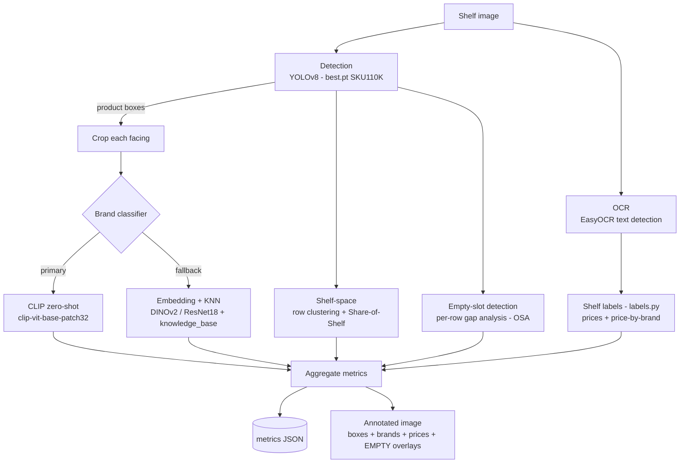

# Pipeline Architecture

The pipeline is a linear sequence of independent, swappable stages. Each stage is
a small module under [`src/shelf_analysis/`](../src/shelf_analysis) so it can be
tested and replaced in isolation.



## Stages

| Stage | Module | Model / method | Output |
|-------|--------|----------------|--------|
| Detection | `detector.py` | YOLOv8m, `models/best.pt` (SKU110K) | class-agnostic product boxes |
| Classification | `classifier.py` | CLIP ViT-B/32 zero-shot (primary); DINOv2/ResNet18 + cosine-KNN (fallback) | brand label + score per box |
| OCR | `ocr.py` | EasyOCR (`en`) | raw text detections + polygons |
| Shelf labels | `labels.py` | price regex + currency; column geometry; fuzzy brand match | `ocr_labels` (prices), `price_by_brand`; optional brand override |
| Shelf-space | `shelf_space.py` | 1-D gap clustering on box y-centres; bbox-width share | `num_shelf_rows`, `share_of_shelf` |
| Empty slots (OSA) | `shelf_space.py` (`find_empty_slots`) | per-row x-gap analysis vs median facing width | `empty_slots[]`, `estimated_missing_facings` |
| Aggregation | `pipeline.py` | - | metrics dict |
| Visualization | `visualize.py` | OpenCV drawing | annotated JPG (product boxes + brands + price tags + red `EMPTY xN` overlays) |

## Data flow

1. **Detect** - `ProductDetector.detect(image)` returns a list of `Box(xyxy, conf)`.
   The detector is class-agnostic: it finds *where* products are, not *what* they are.
2. **Classify** - each box is cropped and passed to the active `BrandClassifier`.
   CLIP compares the crop's embedding against averaged text embeddings of each
   brand's prompts; the arg-max brand wins, or `Other` if confidence is low.
3. **OCR + labels** - EasyOCR reads the whole image (price tags sit on shelf-edge
   strips); `labels.py` keeps the standalone price numbers (re-attaching `₹`) as
   `ocr_labels`, and ties each price to the brand of the products above it
   (`price_by_brand`). Optionally (off by default) it can override the CLIP brand
   when on-pack/tag text confidently names a known brand - see MODEL_SELECTION.md.
4. **Shelf-space** - boxes are clustered into rows by vertical position, and each
   brand's share of total box width gives Share-of-Shelf (SOS).
5. **Empty-slot detection (OSA)** - within each shelf row, horizontal gaps between
   consecutive products that exceed one median facing-width are flagged as
   out-of-stock. Each gap reports the bbox and an estimated count of missing
   facings (`gap_width / median_facing_width`). Edge gaps need to be ≥ 1.5× wider
   before flagging, so normal shelf-end whitespace isn't counted.
6. **Aggregate & visualize** - counts, SOS, rows, prices, empty slots are
   assembled into the metrics dict; the annotated image overlays product boxes,
   brand labels, price tags, and translucent red `EMPTY xN` regions over the OOS
   gaps.

## Output schema

```json
{
  "image_name": "img_4.png",
  "total_products": 68,
  "brands": { "Coca-Cola": 4, "Fanta": 4, "Pepsi": 4, "Other": 4 },
  "share_of_shelf": { "Coca-Cola": "6.0%", "Fanta": "5.0%" },
  "num_shelf_rows": 4,
  "empty_slots": [
    { "row": 1, "x1": 244, "y1": 246, "x2": 526, "y2": 439,
      "width": 281, "est_missing_facings": 5 }
  ],
  "estimated_missing_facings": 15,
  "ocr_labels": ["₹30", "₹50", "₹99", "₹125"],
  "price_by_brand": { "Coca-Cola": "₹50", "Gatorade": "₹75", "Red Bull": "₹110" }
}
```

`image_name`, `total_products`, `brands` and `ocr_labels` satisfy the assignment's
required schema; `share_of_shelf`, `num_shelf_rows`, `price_by_brand`,
`empty_slots` and `estimated_missing_facings` are added insights covering
Share-of-Shelf and On-Shelf Availability.

A static PNG version of the diagram can be regenerated with
[`scripts/make_diagram.py`](../scripts/make_diagram.py).
